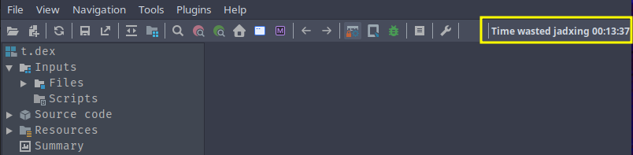

 ## JADX Chronometer plugin

Adds a timer to the jadx toolbar to show how much time is wasted "jadxing" for the current project.

Install using location id: `github:eybisi:jadx-chronometer`

In jadx-cli:
```bash
  jadx plugins --install "github:eybisi:jadx-chronometer"
```

Example timer:



Wasted time is stored at file called "chronometer" which is at cache directory of current project.